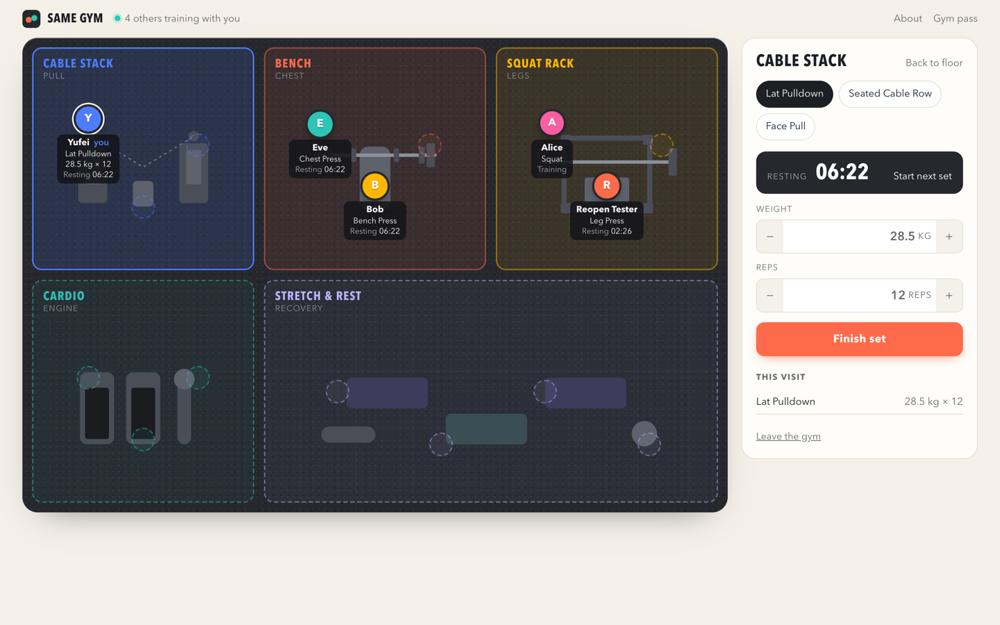

# Same Gym

> A good virtual gym should make individual training feel shared without turning exercise into a meeting, competition, or social feed.

Same Gym is a small shared gym floor on the web. You walk in under a name and a
colour, then train at one of five areas: the cable stack, the bench, the squat rack,
cardio, or stretch and rest. Your dot stands at that station with what you're doing
on its label, for example "Lat Pulldown · Resting 01:20". Anyone else who is in
stands at their own station in the same room. Empty places to stand are drawn as open
spots, because the room is meant to hold several people.

## Who it's for

It's for people who train alone, at home, in a quiet hotel gym or at odd hours, and
miss what a real gym gives you without anyone talking to you: other people working
hard nearby. It's sized for a handful of friends or one class of students, not for
thousands of strangers.

## The opportunity

Most fitness apps record what you did. A real gym also lets you feel who is training
alongside you: the person on the next bench, someone resting between sets, and
nobody making it a conversation. Social fitness apps add feeds, kudos, leaderboards
or video calls, which turn exercise into something to perform or attend. Same Gym
keeps only presence.

## What good means here

1. **The room comes first.** Other people are shown on the floor, where they're
   training, not in a list beside it. You can see that someone is there and what
   they're doing, and nothing more is asked of you.
2. **Logging is something you do in the room.** Tap a station, choose the exercise,
   finish the set. Your last weight and reps for that exercise are already filled
   in, and your dot moves to where you're training.
3. **Your trace is still there.** Refresh, close the browser, or come back tomorrow
   on another device with your gym pass, and you're still you, standing where you
   were, with your sets. Rest timers run from the server's clock, so they keep
   counting while you're away.
4. **Nobody is ranked.** Other people see your exercise and whether you're training
   or resting. They never see your weights or reps, and there are no scores, streaks
   or public history. Your numbers are shown only to you.
5. **It works on a phone.** Phones are what people carry around a gym, so on a phone
   the floor becomes a two-column map, and the logging panel sits underneath at full
   size.

## Why not a workout tracker

A tracker's main view is your history. Here the main view is the present: who is in,
where they're standing, and who is between sets. Your history is kept to bring you
back to your spot, not to be charted or shown off.

## What I deliberately didn't build

No feeds, comments, direct messages, followers, rankings or achievements. No voice or
video. No AI coaching, workout plans, charts or nutrition tracking. No password
accounts: a name, a colour and a gym pass are enough to tell people apart.

## Enforced and judged

Enforced by `spec/`: identity and sets survive across requests, and a pass
recovers the same person; same-name people stay distinct; bad set data is rejected
with nothing saved; the public floor never shows a pass, weights or reps; at
1920×1080 and 390×844, labels stay inside their zones and logging stays usable.
Judged by people: whether the room feels shared, and whether logging feels light.

## Where it is now

This is the first version. Other people appear on the floor when you load the page,
not live as they move. Making the floor update in real time is the next step.

## What I read or looked at

_To write: the sources that shaped this definition of good. The brief points at the
small web, games for a handful of friends and tools built for one workshop._
