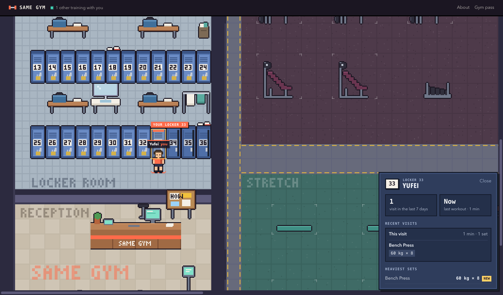
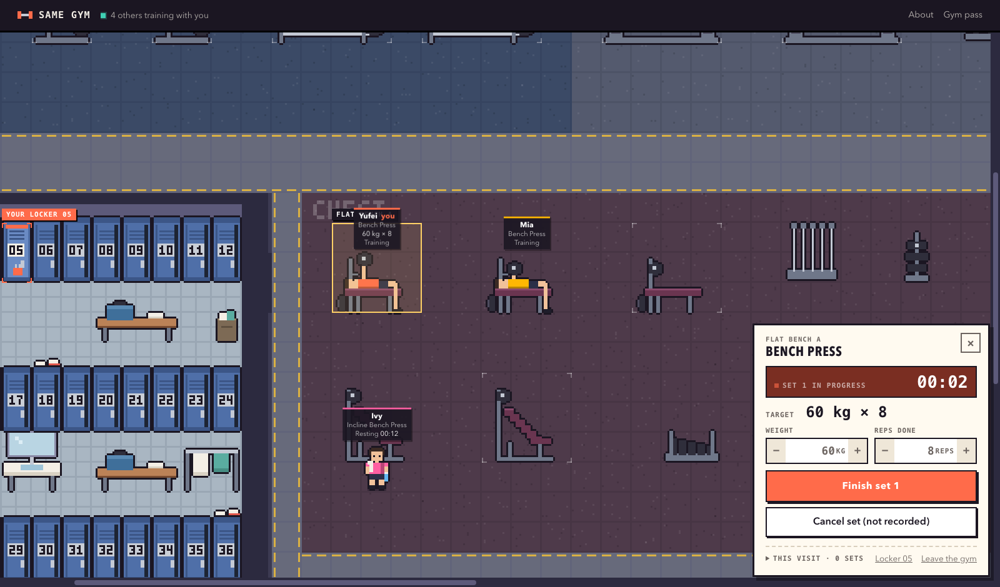
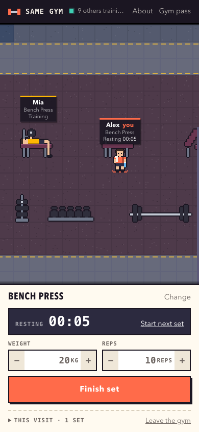

# Same Gym

> A good virtual gym should make individual training feel shared without turning exercise into a meeting, competition, or social feed.

Same Gym is a persistent pixel-art gym on the web, where what you actually do in
your workout controls what your character is doing. You check in at the front desk
as a small pixel person with a name and a shirt colour, and you're given a gym pass
and a locker of your own. The room is larger than your
screen and holds 37 machines in one continuous space:
- treadmills, bikes and rowers under the windows
- a back-and-arms row with pulldowns, a cable row, cable stations, an assisted
  pull-up, a shoulder press and a preacher curl
- free weights in front of the mirror
- flat and incline benches
- squat racks on wooden platforms, leg presses, a leg curl and a leg extension
- stretching mats
- a water-and-rest corner

You start a set from the equipment. Tap an empty bench and it asks what you're
doing: weight and reps. Press **Start set** and your character walks over, lies
down and starts pressing. Press **Finish set** and the set is recorded. They stand
up beside the bench with a towel and a water bottle while your rest timer runs,
and the next set is one tap away. Walk over to the lat pulldown and they sit down
and start pulling.

Anyone else who is in is in the same room, doing their own thing on their own
machine.

> The gym floor shows what is happening now; the locker keeps what you've done before.

There is no profile page and no stats dashboard. What the gym remembers about you
is kept in your locker, in the locker room between reception and the floor. Walk
over, open it, and it shows your recent visits and the sets you did on each, how
many times you've trained in the past week, and your heaviest set of each lift.
Other lockers in the room show only whether they're taken. Nobody else can open
yours.

## Who it's for

It's for people who train alone, at home, in a quiet hotel gym or at odd hours, and
miss what a real gym gives you without anyone talking to you: other people working
hard nearby. It's sized for a handful of friends or one class of students, not for
thousands of strangers.

## The opportunity

Most fitness apps record what you did. A real gym also lets you feel who is training
alongside you: the person on the next bench, someone resting between sets, and
nobody making it a conversation. Social fitness apps add feeds, kudos, leaderboards
or video calls, which turn exercise into something to perform or attend. Same Gym
keeps only presence: a place, and people visibly doing things in it.

## What good means here

1. **The gym is the interface.** The room fills the screen. Logging a set happens
   in a small panel over it, because the panel is only a way to act in the room.
   Other people appear in the room, on the machine they're using, never in a list
   beside it.
2. **The equipment is how you start.** You don't pick an exercise from a list. You
   tap a machine, set up the set it's for (a cable station offers pushdowns, curls
   or face pulls, never squats), and press Start. A set exists only once you
   finish it. Cancel, and nothing is recorded.
3. **What you do is what your character does.** Starting a set walks you to that
   machine and plays its movement: pressing, squatting, pulling, rowing, curling,
   running, pedalling, stretching. Finishing puts you in a resting pose beside it,
   and leaving the station sends you to the water. A label changing on its own
   isn't enough.
4. **The floor is now; the locker is what's kept.** Where you are and what you're
   doing is live, and it goes when you do. Finished sets and visits are kept, and
   you look at them by opening your locker, not on a page outside the gym.
   Reception checks you in and shows how the gym works; it doesn't hold your
   history.
5. **Your trace is still there.** Refresh, close the browser, or come back tomorrow
   on another device with your gym pass. You're still you, with the same locker,
   back on the same machine in the same state, with your sets. Rest timers run from the server's clock, so they
   keep counting while you're away. A set left unfinished (the tab closed mid-set)
   survives a reload, but after ten minutes it's dropped unrecorded and the
   machine is freed. Nobody is left "training" forever. If you close the tab
   without leaving, you're shown as gone after 45 minutes with nothing happening,
   and that visit is closed at your last set.
6. **One machine, one person.** The bench you're on is yours until you leave it or
   rest too long. Someone else tapping it is told it's taken.
7. **Nobody is ranked.** Other people see your exercise and whether you're training
   or resting. They never see your weights or reps, and there are no scores, streaks
   or public history. Your numbers are shown only to you, on your name tag and in
   your locker. "Heaviest set" is just that: the most weight you've finished a set
   with, for lifts with weights. It isn't an estimate, and it's never compared with
   anyone else's.
8. **It works on a phone.** On a phone the gym isn't shrunk to fit. The screen
   becomes a camera onto the same room: you pan around it, it follows you when you
   walk, and the set panel slides up from the bottom.

## Why not a workout tracker

A tracker visualises your history. This is a place: the main view is the room in
the present, showing who is in, where they're standing and who is between sets.
Your sets are stored so the gym can put you back where you were and fill in your
last weight, not to be charted or shown off.

## What I deliberately didn't build

No feeds, comments, direct messages, followers, rankings or achievements. No voice or
video. No AI coaching, workout plans, charts or nutrition tracking. No character
creator: one pixel body in your chosen shirt colour. No free-roaming movement yet:
you walk where your workout takes you. Furniture you can't use (racks, plates,
sofas, the front desk) is drawn so that it doesn't look like a machine. No password accounts: a name, a colour and a
gym pass are enough to tell people apart.

## Enforced and judged

Enforced by `spec/`:
- Identity and sets survive across requests, and a pass recovers the same person.
- Starting a set records nothing, finishing records it, and cancelling records
  nothing.
- One machine holds one person, and a second set can't start while one is under
  way.
- An exercise must belong to its machine.
- An abandoned set expires unrecorded and frees the machine.
- Old database rows are read sensibly.
- Each identity gets its own locker, and its pass brings back the same one.
- The locker holds finished sets only, never started or cancelled ones.
- The locker opens only for its owner. The room shows which lockers are taken,
  not by whom.
- Visits are kept apart, and the past-week count and heaviest sets are right.
- Someone idle for 45 minutes is gone, with their visit closed.
- When the room is full, a locker goes to a newcomer from whoever has been gone
  longest.
- A real browser that joins and reloads is still the same person, with only the
  pass stored locally.
- Bad set data is rejected and nothing is saved.
- The public floor never shows a pass, weights or reps.
- At 1920×1080 and 390×844, the gym is larger than the screen and drawn with crisp
  pixels, and isn't shrunk below 2× scale.
- Every machine is tappable.
- Tapping the lat pulldown only sets it up. Start set walks you there, with the
  camera following.
- The machine you're on visibly animates.
- Finish set records the set and leaves you resting beside it.
- Your locker opens from the room with the set in it, readable and fitting the
  screen.
- A reload marks the same locker as yours.
- Neighbours' name tags don't overlap, and logging stays usable.

Judged by people: whether the room feels shared, and whether logging feels light.

## Where it is now

This is the crit 8 version. Everything you do is saved on the server, and other
people appear in the room as they were when your page last loaded or you last did
something. They don't yet move live while you watch. Making the room update in real
time, so you see someone walk to the rack while you rest, is the next step.

## What I read or looked at

Gather's virtual offices were the reference for spatial scale and the feeling of
sharing one room. I used none of its art, maps or code: every sprite here is drawn
from code in `public/sprites.js`.

_To write: the other sources that shaped this definition of good. The brief points
at the small web, games for a handful of friends and tools built for one workshop._
